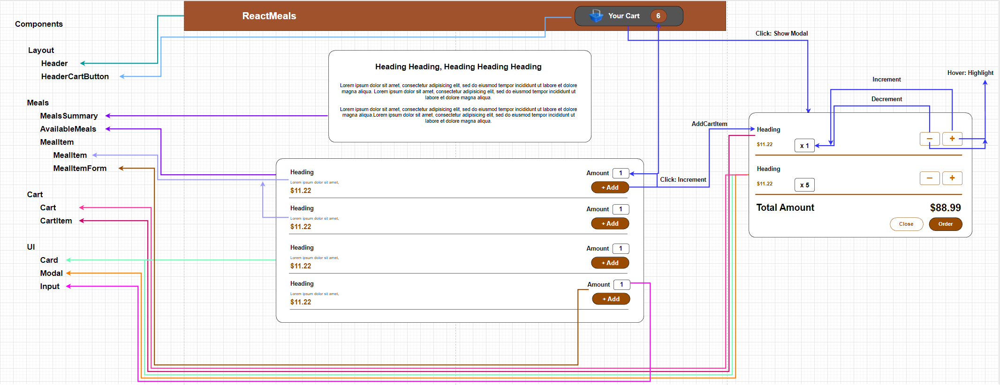

# Food Ordering App
<table>
<tr>
<td>
  A web application created using React and FireBase. Its purpose is to present the restaurant's menu, along with an order cart and collecting the customer's shipping address. It offers a clean design and an aesthetically pleasing list of dishes along with a shopping cart that counts the quantity and final price of the order.
</td>
</tr>
</table>

## Table of Contents
* [General Info](#general-information)
* [Technologies Used](#technologies-used)
* [Features](#features)
* [Screenshots](#screenshots)
* [Setup](#setup)
* [To-do](#to-do)
* [Acknowledgements](#acknowledgements)


## General Information
The goal of this project is to create an aesthetically pleasing app for restaurants and take-out food establishments. The main advantages are a clean simple interface and an interactive cart with ordered food to which we can add or remove dishes at any time, and the final price is automatically calculated.
The application uses React and FireBase to backednow server to fetch the menu list and send the address entered by the customer with the selected order.
This project was created to solidify the knowledge I have acquired in previous sections of the course.


## Technologies Used
- React
- Firebase (Realtime Database)


## Features
List the ready features here:
- Adding and deleting dishes in the cart
- Automatic calculation of the cart items
- Order counter on the cart button
- Submitting Orders to a Backend Server (Http)
- Fetching Meals Data from a Backend Server
- Checkout Form with validation


## Screenshots

### Food Ordering App Diagram


### Checkout Modal
When the `Order` button is clicked, the modal expands and shows a format for entering the order address


## Setup
To clone and run this web application, you'll need [Git](https://git-scm.com) and [Node.js](https://nodejs.org/en/download/) (which comes with [npm](http://npmjs.com)) installed on your computer. From your command line:

```bash
# Clone this repository
$ git clone https://github.com/Niziol/Food-Ordering-App.git

# Go into the repository
$ cd Food-Ordering-App

# Install dependencies
$ npm install

# Run the app
$ npm start
```


## To-do
- Beautify the scroll bar in Checking Form

Room for improvement:
- Adding the option to support payment card
- Creating a contact page along with using Google's API to mark places on a map
- Implementation of the final step of sending the collected data along with the form of delivery and notification of the restaurant about the order


## Acknowledgements
- This project was based on [React - The Complete Guide 2024 (incl. React Router & Redux)](https://www.udemy.com/course/react-the-complete-guide-incl-redux/).
